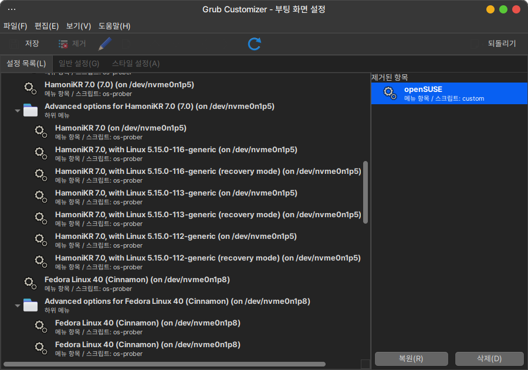
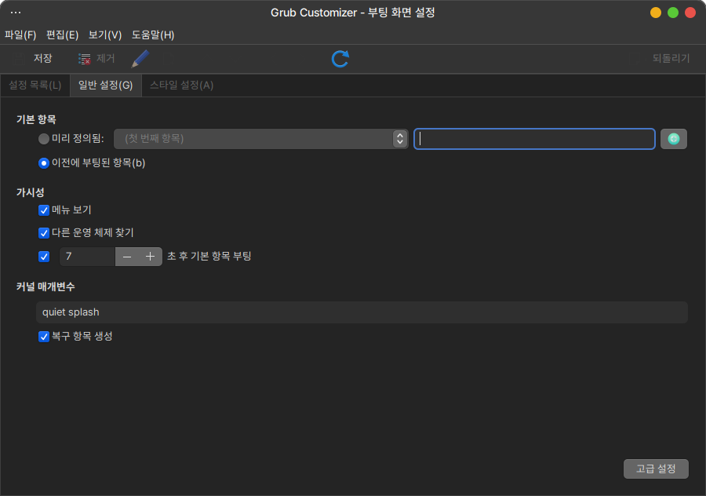
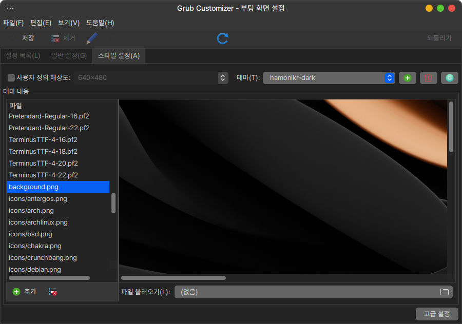

[](https://github.com/hamonikr/nimf/actions/workflows/build.yml)

## Grub Customizer

이 프로젝트는 데비안, 우분투, 하모니카OS 등의 환경에서 사용할 수 있는 부트로더 설정 도구입니다.

### 주요 기능

* 시스템 시작시 보이는 부팅 메뉴를 쉽게 편집할 수 있는 기능



* 부팅할 메뉴 선택, 대기시간 등 다양한 설정 편집 기능



* 부팅 화면의 테마를 자유롭게 구성하는 기능



### Upstream:
 * https://launchpad.net/grub-customizer


# Install

## Ubuntu, Debian, LinuxMint

```
wget -qO- https://pkg.hamonikr.org/add-hamonikr.apt | sudo -E bash -

sudo apt install grub-customizer
```